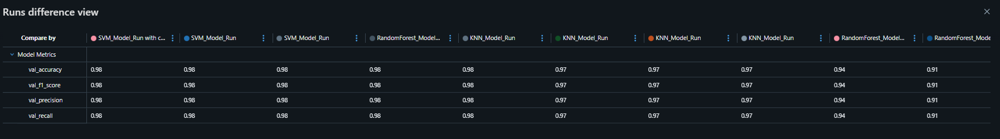

# Hand Gesture Classification Project – Researcher Branch

## Overview

This branch focuses on **experimental model training and evaluation** for hand gesture recognition. the experiment is tracked using **MLflow** to log:

- Model parameters, metrics, and input examples  
- Training and validation datasets  
- Artifacts such as confusion matrices  
- Registered models in the MLflow Model Registry  

---

## Features

* Extract **21 hand landmarks** (x, y, z) per hand using MediaPipe Hands.
* Flatten landmarks into **63 features** for ML models.
* Train and evaluate multiple models:
  * RandomForestClassifier
  * SVM (Support Vector Machine)
  * K-Nearest Neighbors (KNN)
* Compute evaluation metrics: Accuracy, Precision, Recall, F1-Score
* Generate and **save confusion matrices** for each model
* Log experiments with **MLflow**, including:
  * Parameters
  * Metrics
  * Datasets (training)
  * Artifacts such as confusion matrices and encoder file
* Save trained **model pipelines**
* Register the **best performing model** in the MLflow Model Registry

---


## MLflow Tracking

* **Experiment Name:** `Hand_Gesture_Classification_Exp`  
* **Run Names:** Descriptive names like `KNN_Model_Run`, `SVM_Model_Run`  
* **Registered Model Name:** `HandGesture_Classifier`  
* **Artifacts Tracked:** Confusion matrices, model pipelines, input examples  
* **Metrics Tracked:** Accuracy, Precision, Recall, F1-Score  
* **Datasets Logged:** Training datasets for reproducibility  

All runs, metrics, artifacts, and model registrations are tracked in MLflow to allow easy comparison and selection of the best model.
---
# Model Development and Selection

## Model Configurations

To determine the best-performing classifier for hand gesture recognition, two configurations were evaluated for each algorithm.

### Initial Configuration
```python

models = {
    "RandomForest": RandomForestClassifier(n_estimators=100, random_state=42),
    "SVM": SVC(kernel='rbf', C=10, gamma=0.1, random_state=42),
    "KNN": KNeighborsClassifier(n_neighbors=5)
}
```

### Tuned Configuration

## Model Parameter Tuning & MLflow Logging

This project allows experimentation with **different hyperparameters** for each machine learning model. In the notebook, the models are defined as follows:

```python
models = {
    "RandomForest": RandomForestClassifier(n_estimators=100, max_depth=8, random_state=42),
    "SVM": SVC(kernel='rbf', C=100, gamma=0.1, random_state=42),
    "KNN": KNeighborsClassifier(n_neighbors=7)
}
```

### What This Means

* You can **adjust parameters** such as:

  * RandomForest: `n_estimators`, `max_depth`
  * SVM: `C`, `gamma`
  * KNN: `n_neighbors`
* Each combination of parameters is **tested** to find the best-performing configuration.
* These experiments are **logged using MLflow**, which records:

  * Model type and hyperparameters
  * Validation metrics (Accuracy, Precision, Recall, F1-Score)
  * Trained model artifacts
  * Confusion matrices

### Benefits

* **Experiment tracking**: Easily compare multiple parameter sets in MLflow UI.
* **Performance analysis**: Quickly identify which parameters yield the best metrics.
* **Reproducibility**: All experiments and trained models are saved for later use.

---
## Evaluation Strategy

The dataset was split using a 60/20/20 strategy:

* 60% Training
* 20% Validation
* 20% Testing

Models were evaluated using:

* Accuracy
* Precision
* Recall
* F1-Score (Primary Selection Metric)
* Confusion Matrix
* Multi-class ROC Curve

## Final Model Selection

After comparing all models using validation metrics and MLflow visualizations:

* The best-performing model was Support Vector Machine (SVM)
* Kernel: RBF
* C = 100
* Gamma = 0.1

This configuration achieved the highest validation F1-score, indicating strong generalization performance and balanced precision-recall across gesture classes.

The RBF kernel enabled SVM to effectively capture non-linear relationships within the 63-dimensional landmark feature space, leading to superior class separation compared to other models.

All experiments, metrics, and artifacts were tracked using MLflow to ensure reproducibility and transparent model comparison.

---

## Results (Research Branch)

### Confusion Matrices (Final Tuned Models)

The displayed confusion matrices were generated using the final tuned configurations:

* RandomForestClassifier (n_estimators=100, max_depth=8, random_state=42)
* SVC (RBF kernel, C=100, gamma=0.1, random_state=42)
* KNeighborsClassifier (n_neighbors=7)

**RandomForest**  
  

**SVM**  
  

**KNN**  
  

---

### Model Comparison

**Models Comparison Table**  

  


> These metrics are logged via MLflow for all runs, allowing you to track experiments, compare models, and select the best-performing model for registration.
---

**Best Model – F1 Score**
**SVM (RBF,c=100, gamma=0.1)**
.png)  

**Registered Model**


---

## MLflow Hyperparameter Experiments

All models were trained with **multiple hyperparameter configurations** and logged using **MLflow**. This allows tracking each run, visualizing metrics, and comparing different configurations.

### Experiment Setup

* Each model type (**RandomForest, SVM, KNN**) was trained with **4 different hyperparameter sets**.
* Hyperparameters such as `n_estimators`, `max_depth`, `C`, `gamma`, and `n_neighbors` were varied.
* Metrics logged: **Validation Accuracy, Precision, Recall, F1-Score**.
* Trained models and confusion matrices were saved as artifacts in MLflow.

### Visual Comparison

The following MLflow parallel coordinates plot shows the effect of `max_depth` and `n_estimators` on **RandomForest validation accuracy** across 4 different runs:


> Similar logging and comparisons were performed for **SVM** (varying `C` and `gamma`) and **KNN** (varying `n_neighbors`).

.png)


.png)


## License

This project is released under the **MIT License**.
