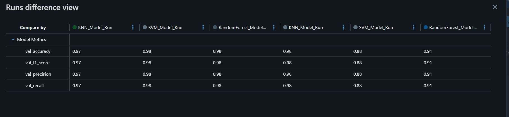
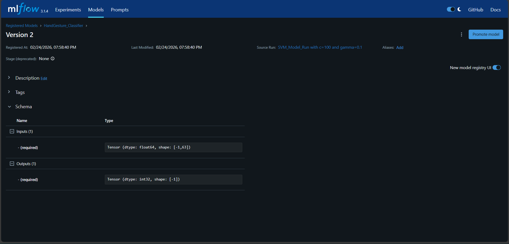

# Hand Gesture Classification Project – Researcher Branch

## Overview

This branch focuses on **experimental model training and evaluation** for hand gesture recognition. All experiments are tracked using **MLflow** to log:

- Model parameters, metrics, and input examples  
- Training and validation datasets  
- Artifacts such as confusion matrices  
- Registered models in the MLflow Model Registry  

This branch is intended for **research and experimentation** before merging stable models into `main`.

---

## Features

* Extract **21 hand landmarks** (x, y, z) per hand using MediaPipe Hands.
* Flatten landmarks into **63 features** for ML models.
* Train and evaluate multiple models:
  * RandomForestClassifier
  * SVM (Support Vector Machine)
  * K-Nearest Neighbors (KNN)
* Compute evaluation metrics: Accuracy, Precision, Recall, F1-Score
* Generate and **save confusion matrices** for each model
* Log experiments with **MLflow**, including:
  * Parameters
  * Metrics
  * Datasets (training)
  * Artifacts such as confusion matrices and encoder file
* Save trained **model pipelines**
* Register the **best performing model** in the MLflow Model Registry

---

## MLflow Tracking

* **Experiment Name:** `Hand_Gesture_Classification_Exp`  
* **Run Names:** Descriptive names like `KNN_Model_Run`, `SVM_Model_Run`  
* **Registered Model Name:** `HandGesture_Classifier`  
* **Artifacts Tracked:** Confusion matrices, model pipelines, input examples  
* **Metrics Tracked:** Accuracy, Precision, Recall, F1-Score  
* **Datasets Logged:** Training datasets for reproducibility  

All runs, metrics, artifacts, and model registrations are tracked in MLflow to allow easy comparison and selection of the best model.
---
# Model Development and Selection

## Model Configurations

To determine the best-performing classifier for hand gesture recognition, two configurations were evaluated for each algorithm.

### Initial Configuration

models = {
    "RandomForest": RandomForestClassifier(n_estimators=100, random_state=42),
    "SVM": SVC(kernel='rbf', C=10, gamma=0.1, random_state=42),
    "KNN": KNeighborsClassifier(n_neighbors=5)
}

### Tuned Configuration

models = {
    "RandomForest": RandomForestClassifier(n_estimators=100, max_depth=8, random_state=42),
    "SVM": SVC(kernel='rbf', C=10, gamma=0.01, random_state=42),
    "KNN": KNeighborsClassifier(n_neighbors=7)
}

## Evaluation Strategy

The dataset was split using a 60/20/20 strategy:

* 60% Training
* 20% Validation
* 20% Testing

Models were evaluated using:

* Accuracy
* Precision
* Recall
* F1-Score (Primary Selection Metric)
* Confusion Matrix
* Multi-class ROC Curve

## Final Model Selection

After comparing all models using validation metrics and MLflow visualizations:

* The best-performing model was Support Vector Machine (SVM)
* Kernel: RBF
* C = 10
* Gamma = 0.1

This configuration achieved the highest validation F1-score, indicating strong generalization performance and balanced precision-recall across gesture classes.

All experiments, metrics, and artifacts were tracked using MLflow to ensure reproducibility and transparent model comparison.

---

## Results (Research Branch)

### Confusion Matrices

**RandomForest**  
  

**SVM**  
  

**KNN**  
  

---

### Model Comparison

**Models Comparison Table**  

  

> These metrics are logged via MLflow for all runs, allowing you to track experiments, compare models, and select the best-performing model for registration.
---

**Best Model – F1 Score**
**SVM (RBF, gamma=0.1)**
.png)  

**registered model**

---

## Notes for Research Branch

* All MLflow experiments and model registrations happen on the `researcher` branch.  
* Use descriptive run names to track experiments effectively.  
* This branch is for experimentation; stable models should be merged into `main` after validation.  

---

## License

This project is released under the **MIT License**.
