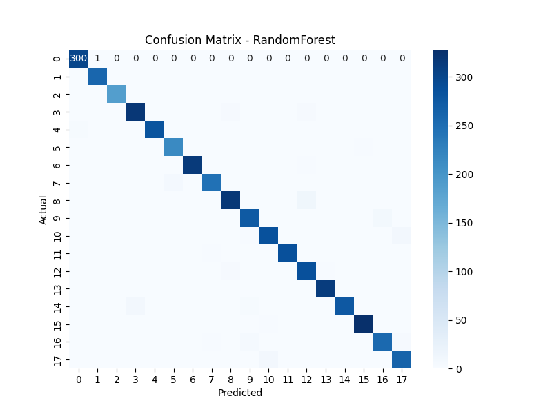
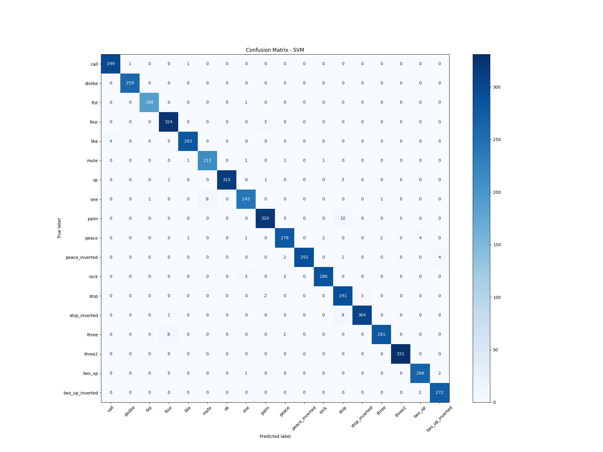
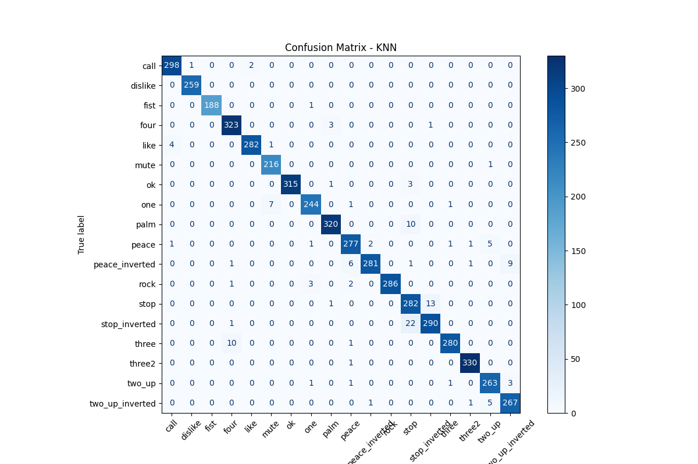

# Hand Gesture Classification Project

## Overview

This project implements a **hand gesture recognition system** using machine learning. It uses **MediaPipe Hands** to extract 21 hand landmarks from video frames and classifies gestures with different ML models such as **RandomForest, SVM, and KNN**. The project evaluates model performance and saves both trained models and confusion matrices for analysis.

---

## Features

* Extract **21 hand landmarks** (x, y, z) per hand using MediaPipe.
* Flatten landmarks into **63 features** for ML models.
* Train and evaluate multiple models:

  * **RandomForestClassifier**
  * **SVM (Support Vector Machine)**
  * **K-Nearest Neighbors (KNN)**
* Compute evaluation metrics:

  * Accuracy, Precision, Recall, F1-Score
* Generate and **save confusion matrices** for each model.
* Save trained **model pipelines** for future use.

---

## Installation

1. Clone the repository:

```bash
git clone https://github.com/Merna-Hany12/Hand-Gesture-Classification-model.git```

2. Create a virtual environment and activate it (optional but recommended):

```bash
python -m venv env
# Windows
env\Scripts\activate
# Mac/Linux
source env/bin/activate
```

3. Install dependencies:

```bash
pip install -r requirements.txt
```

**Example requirements.txt**:

```
# ----------------------------
# Hand Tracking & Computer Vision
# ----------------------------
mediapipe==0.10.32
opencv-python==4.11.0

# ----------------------------
# Data Handling
# ----------------------------
pandas==2.0.3
numpy==1.26.4

# ----------------------------
# Machine Learning
# ----------------------------
scikit-learn==1.1.3
joblib==1.2.0

# ----------------------------
# Visualization
# ----------------------------
matplotlib==3.9.4
seaborn==0.12.2
```
---

## Usage
1. **Prepare your dataset**:
   * Video or images of hand gestures.
   * Extract landmarks using MediaPipe Hands.
   * Flatten landmarks to `[x1, y1, z1, ..., x21, y21, z21]`.

2. **Train models and evaluate**:
 
Open the notebook hand_gesture.ipynb in Jupyter Notebook and run the cells sequentially.

The notebook will:
* Preprocess the landmarks: recenter using the wrist and normalize based on finger length.
* Encode labels: convert gesture names into numeric labels.
* Train all models in your `models` dictionary (**RandomForest, SVM, KNN**).
* Compute metrics.
* Save **trained pipelines** in `../models/`.
* Save **confusion matrices** in `../models/confusion_matrices/`.

3. **Predict new gestures**:

```python
import joblib

pipeline = joblib.load("../models/SVM.pkl")
y_pred = pipeline.predict(new_hand_landmarks)
```

---

## Results

* Each model prints a **classification report** with accuracy, precision, recall, and F1-score.
* Confusion matrices are visualized and saved for analysis, helping to identify misclassified gestures.
* Trained models can be reused for predicting new hand gestures.
Confusion Matrices

RandomForest:
  

SVM:
  

KNN:
  

Model Comparison
| Model        | Accuracy | Precision | Recall   | F1-Score |
| ------------ | -------- | --------- | -------- | -------- |
| RandomForest | 0.975852 | 0.976064  | 0.975852 | 0.975887 |
| SVM          | 0.982473 | 0.982712  | 0.982473 | 0.982508 |
| KNN          | 0.973905 | 0.974445  | 0.973905 | 0.973999 |

**"The best-performing model is the Support Vector Machine (SVM) with an RBF kernel, C=100, and gamma=0.1, achieving the highest F1-score among all evaluated models."**
## MediaPipe Hands Integration
---

This project uses **MediaPipe Hands** to detect and track hand landmarks in real time from videos. The workflow is as follows:

### 1. **Model Download**

* The pre-trained MediaPipe **hand_landmarker task model** (`hand_landmarker.task`) is automatically downloaded if not present.
* This model is used for detecting **21 3D hand landmarks** per hand (x, y, z coordinates).

### 2. **Hand Detection & Landmark Extraction**

* A **MediaPipe HandLandmarker** is created with these parameters:

  * `num_hands=1` – detects one hand per frame
  * `min_hand_detection_confidence=0.7`
  * `min_hand_presence_confidence=0.7`
  * `min_tracking_confidence=0.7`
* For each detected hand, the 21 landmarks are extracted and stored as a 63-dimensional vector `[x1, y1, z1, ..., x21, y21, z21]`.

### 3. **Drawing Landmarks**

* Landmarks are visualized on the video using:

  * **Dots** for each joint
  * **Lines** connecting the joints based on predefined `HAND_CONNECTIONS`
* This allows clear visualization of the detected hand skeleton.

### 4. **Preprocessing & Prediction**

* Landmarks are **recentered** using the wrist as the origin and **normalized** based on finger lengths.
* Preprocessed landmarks are passed to the **trained SVM pipeline** (best model: **C=100, gamma=0.1**) for gesture prediction.
* Predicted labels are decoded using the **LabelEncoder** and displayed on the video.

### 5. **Video Input/Output**

* Input video is read via OpenCV (`Sample.mp4`) and output is saved to `../output/output_video.mp4`.
* FPS and predicted gesture labels are overlaid on each frame in real time.
* The system supports real-time visualization and can quit by pressing **'q'**.

---
Perfect — here’s a **ready-to-add section** for your README that explains **step by step how to try MediaPipe inside the notebook**, including importing the library, running the preprocessing function, and then running MediaPipe detection:

---

## Trying MediaPipe & Landmark Preprocessing

This section shows how to **test hand landmark detection and preprocessing** directly in the notebook.

---

### 1. Import Required Libraries

At the top of your notebook, make sure you import the required packages:

```python
import os
import cv2
import numpy as np
import mediapipe as mp
from mediapipe.tasks import python
from mediapipe.tasks.python import vision
from collections import deque
```

These are required for:

* Video processing (`cv2`)
* Landmark detection (`mediapipe`)
* Numerical operations (`numpy`)
* Temporal smoothing (`deque`)

---

### 2. Run Preprocessing Function

Before feeding landmarks into your model, preprocess them using the notebook function:

```python
def preprocess_landmarks(sample):
    landmarks = sample.reshape(21, 3)
    landmarks = landmarks - landmarks[0]          # Recenter at wrist
    scale = np.linalg.norm(landmarks[12])         # Normalize by finger length
    if scale != 0:
        landmarks = landmarks / scale
    return landmarks.flatten()
```

**Usage example:**

```python
# Example: preprocess a single hand landmark array
sample_landmarks = np.random.rand(63)  # 21 landmarks x 3 coordinates
processed_landmarks = preprocess_landmarks(sample_landmarks)
print(processed_landmarks.shape)  # Should be (63,)
```

This ensures translation and scale invariance before running predictions.

---

### 3. Run MediaPipe Hand Detection

1. **Download the MediaPipe model** if not already present:

```python
model_path = "hand_landmarker.task"
model_url = "https://storage.googleapis.com/mediapipe-models/hand_landmarker/hand_landmarker/float16/1/hand_landmarker.task"

if not os.path.exists(model_path):
    print(f"Downloading {model_path}...")
    import urllib.request
    urllib.request.urlretrieve(model_url, model_path)
    print("Download complete!")
```

2. **Initialize MediaPipe HandLandmarker**:

```python
base_options = python.BaseOptions(model_asset_path=model_path)
options = vision.HandLandmarkerOptions(
    base_options=base_options,
    num_hands=1,
    min_hand_detection_confidence=0.7,
    min_hand_presence_confidence=0.7,
    min_tracking_confidence=0.9
)
detector = vision.HandLandmarker.create_from_options(options)
```

3. **Process a video frame** (or webcam frame):

```python
cap = cv2.VideoCapture("../data/Sample2.mp4")  # Or 0 for webcam

while cap.isOpened():
    ret, frame = cap.read()
    if not ret:
        break

    rgb_frame = cv2.cvtColor(frame, cv2.COLOR_BGR2RGB)
    mp_image = mp.Image(image_format=mp.ImageFormat.SRGB, data=rgb_frame)
    result = detector.detect(mp_image)

    if result.hand_landmarks:
        for hand_landmarks in result.hand_landmarks:
            # Extract coordinates
            landmarks = np.array([[lm.x, lm.y, lm.z] for lm in hand_landmarks]).flatten()
            # Preprocess landmarks
            processed = preprocess_landmarks(landmarks)
            print("Processed landmarks:", processed[:9], "...")  # Display first 3 points
    break  # Remove break to run full video

cap.release()
```


--- 

**Summary:**
MediaPipe Hands provides **accurate 3D hand landmarks**, which are used as input features for the machine learning pipeline. Combined with the trained SVM classifier, this allows real-time gesture recognition and visualization in videos.


## License

This project is released under the **MIT License**.

